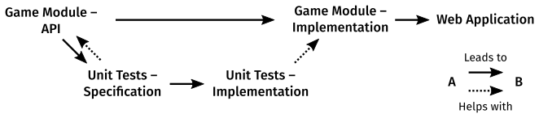

# Module descriptor and assessment brief ##
In Computing 2: Applications students will learn about application programming,
i.e. writing computer programs for end-users.
This module focuses on web applications and
students will learn technologies associated with this.
Students will be exposed to new computing paradigms
that build on from Computing 1,
such as functional programming and event-driven programming.
Students will also learn about user interface and experience.
By the end of the module, students will code their own web-app project
incorporating what they have learned.

  **Module Submission Deadline: Thursday 26th June 16:00**

## Learning outcomes ##
*On completion of this module, students will be better able to:*

**Coding (Reinforces S3,  K4):**
Write computer applications for human interaction
using a set of modern paradigms.

**UX/UI (Introduces K2):**
Design and implement user experiences and interfaces.

**Data (Introduces K1):**
Manipulate data structures.

**Debugging (Reinforces S1, Introduces A1):**
Debug their own programs, identifying, documenting, and solving software bugs.

**Best practice (Reinforces S1, Introduces A2):**
Engage with industry/professional best practice in managing a coding project.

## Assignment brief ##
The assignment is to produce a web app for a
*"Turn-based"* *"Board-based"* *"Game"* of your choosing.
(In quotes as you can loosely or strictly interpret each of these terms.)

Your submission will have a number of separately assessed components.
### Game Module – API ###
You will produce an
<abbr title="Application Programming Interface">API</abbr>
specification,
i.e. a list of function names and their signatures,
for a Javascript module
that represents the state of your game and the operations
you can perform on it that advances the game or provides information.

### Game Module – Implementation ###
You will implement, in Javascript, the module you specified above.
Such that your game can be simulated in code, e.g. in the debug console.

### Unit Tests – Specification ###
For the Game module API you have produced,
write a set of unit tests descriptions that specify the expected behaviour of one aspect of your API,
e.g. you might pick the win condition, or how the state changes when a move is made.

### Unit Tests – Implementation ###
Implement in code the unit tests specified above.

### Web Application ###
Produce a web application that allows a user to interface with your
game module.

## Learning and teaching strategy ##
This is a project based learning module with a
**100% individual coursework** authentic assessment.

The skills learned throughout the module will be assessed in the
final deliverable that students will frame to their own interests and ideas.

The assessment criteria are linked directly to the
module learning outcomes and are detailed below.

## Assessment criteria
Assessment criteria are split into the five submission components.
For each, there is a *Passing Criterion* that must be met.
The other criteria are *Excellent Criteria*,
which will the grade of each component by how many are met.

### Game Module – API
* **Passing:**
  * Documents an API for a Javascript module.
* **Excellent:**
  * Has a suitable range of functions relevant to the domain at hand. I.e. functions to transition between valid game states and extract relevant information from the state.
  * The functions are documented primarily in terms of their domain rather than their implementation.
  * API is clear to follow and understand.
  * Appropriate function signatures, e.g. parameters, order, and return types.
  * Good use of the tooling (jsdoc)

### Game Module – Implementation
* **Passing:**
  * API is implemented in code as described.
* **Excellent:**
  * Implementation is efficiently coded.
  * Implementation is mostly free of bugs.
  * Functions in the game module are pure functions.
  * Appropriate use of functional patterns, e.g composition, map, filter, reduce, partial application, recursion, etc.
  * Javascript source code passes linter (jslint) without error.

### Unit Tests – Specification
* **Passing:**
  * Define a set of tests relevant to the domain at hand.
* **Excellent:**
  * Define a suitable range of tests that specify for a significant aspect of the game module.
  * Tests are for behaviour rather than implementation.
  * Descriptors for tests are clear for the behaviour they are specifying.

### Unit Tests – Implementation
* **Passing:**
  * Tests are implemented as specified to examine the module under test.
* **Excellent:**
  * Tests are not a re-implementation of the code under test.
  * Tests fail in a way that provides useful context to identify the bug.
  * Test failure modes should be reachable with some particular failing implementation. *"Never trust a test you haven't seen fail."*

### Web Application
* **Passing:**
  * Provides a web browser based user interface for the chosen game.
* **Excellent:**
  * User interface is clean and intuitive.
  * Handles an appropriate range of input or timer events.
  * The interface represents and allows interaction at all reasonably accessible game states.
  * Project separates structural (html), styling (css), and behavioural (javascript) code.
  * The interface references the game module for access to its functions, without implementing game logic itself.
  * Follows accessibility guidelines. (E.g. with attention to semantic markup, keyboard access, contrast and colour-blindness, etc. – Use the audit tools to identify issues)

Components will be marked as:
|  |  |
|---|---|
| **Fail (F)** | if the work does not meet the *Passing Criterion*. |
| **Pass (D)** | if the work meets the *Passing Criterion*, but doesn't qualify for any higher grade. |
| **Good (C)** | if the work meets the *Passing Criterion*, and **some** of the *Excellent criteria.* |
| **Very Good (B)** | if the work meets the *Passing Criterion*, and **most** of the *Excellent Criteria*. |
| **Excellent (A)** | if the work meets the *Passing Criterion*, and **all** of the *Excellent Criteria*. |
| **Exceptional (A٭)** | if the work meets all of the points of the Excellent (A) descriptor and is a level of quality higher than what would usually be expected for Excellent (A) work. |

### Overall Mark

The overall mark will be determined by the component grades in an expected ratio of:
* 1 / 3 – Game Module (API + Implementation)
* 1 / 3 – Unit Tests (Specification + Implementation)
* 1 / 3 – Web Application

Students must achieve a passing grade in every assessment criterion
to be awarded a passing grade for the assessment as a whole.

### Example Submission
The [Example submission – Zombie Siege](https://github.com/fourier-space/zombie-siege) would score Excellent (A) on all assessment criteria.

### Additional Credit
Additional credit on top of the overall mark may be awarded for,
* Providing feedback in peer assessment. **(+2.5%)**
* Peer assessment feedback being useful. **(+2.5%)**
* Good Citizenship – at the discretion of the module leader – for continuous efforts in support of the academic community, e.g. assisting other, answering and asking questions, e.g. on [ed](../Learning_environment/README.md) **(+5%)**

A **5%** penalty may be applied if the submission requirements aren't adhered to and this leads to problems in opening or running the submission for assessment.

## Submission Requirements ##
Your submission must also conform to the following:

1. Your coding project must be written in Javascript.
1. Your directory structure must match the provided template. i.e.
    * there is a `web-app` directory at the top level of your repository.
    * This contains a `tests` subdirectory.
1. Any additional packages that you use must be installable from `npm` and must install and run cross-platform (i.e on the examiners' computers). **Speak with me in advance if you are doing anything out of the ordinary here.**
1. Do not upload packages files (i.e. `/node_modules/`) to your repository. The `.gitignore` file will filter these out for you.

Each of these will be automatic if you follow the provided submission template.

## Code submission – GitHub Classroom ##
This coursework will be submitted by pushing to a GitHub repository.
The last push to the repository made before the module deadline will be considered.

Github Classroom will be used for you to create this repository.
To access github classroom, you will need to link your to your GitHub account.
Follow the links on [Blackboard](https://bb.imperial.ac.uk/webapps/blackboard/content/listContentEditable.jsp?content_id=_2332182_1&course_id=_31783_1) for the assignment and link your account to your
name then fork your own submission repository.
