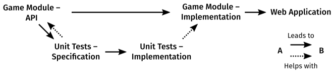

# Computing 2: Applications – Module Handbook – 2021/22

```json
{
    "Version": "3.0.1",
    "Updated": "2022-05-06"
}
```

## Teaching staff ##
### Module leadership ###

|  |  |
|---|---|
| Dr Freddie Page | Dr Pietro Ferraro |
| Module Leader | Associate Module Leader |

### Teaching assistants ###
|  |  |  |  |  |
|---|---|---|---|---|
| Max Matthews | Cosmin Vonsovici | Amelia Bryant | Amy Walter | Sarthak Das |
|  |  |  |  | |
| Michela Puglia | Laura Bastos | Jack Beaumont | James Howells |  |

## You Said, We Did – Changes from last year
In response to student feedback and to improve the module,
the following changes have been made from last year.

### Constrained submission – Game
Students had found the assignment brief too open ended previously.
This made it difficult to know where to start.
The brief is now a game (details below),
which will make it easier to target the assessment criteria of the module.

### Structured submission
Common feedback from last year was that it was difficult to know how to get started.
This year the submission is sectioned into separate parts,
Game Module (API and Implementation), Unit Tests (Specification and Implementation), and Web App.
This will assist in getting started on the project,
but also train good practices in structuring of your software project.
The module's assessment criteria have been rewritten for this new structure.

### Example coursework
Students often ask for a previous example of a coursework submission,
it can be difficult to provide this as there are changes to the submission requirements from year to year.
So I've prepared an
[example submission](
https://github.com/fourier-space/zombie-siege
)
that fits this year's requirements.


### Reduced Scope
This is a one-term module in computing and web applications.
There's lots of exciting further directions you can go in
following on from this module, including: Generative Property Based Testing, Databases, External APIs, Sessions, etc.
These used to be part of the coursework brief, but are no longer so.
You're welcome to explore these and chat to me about them,
but they're no longer part of the *Excellent (A)* criteria,
and we won't cover them in the taught sessions.
The server side aspect of a web app is still included but its scope is reduced to the client's interactions with a server.

### Starter Code
The directory structure of a web app can get complicated.
There's lots of configuration files for different parts of the tooling,
as well as directories for different aspects of the app.
I provide starter code for your submission that sets this up with sensible defaults.
Submissible webserver code is also included that can form part of your web app.
This is automatically copied when you create your submission repository on GitHub Classroom,
[but the template can also be found here.](
https://github.com/fourier-space/Computing-2-Submission-Template
)

### Peer Assessment
Peer assessment has run every year, and has been very useful to the students who have participated.
Previously this has been formative only,
but to encourage engagement, bonus credit is available for participation.

## Module descriptor ##
**From the module specification:**
In Computing 2: Applications students will learn about application programming,
i.e. writing computer programs for end-users.
This module focuses on web applications and
students will learn technologies associated with this.
Students will be exposed to new computing paradigms
that build on from Computing 1,
such as functional programming and asynchronous programming.
Students will also learn about user interface and experience,
accessing and manipulating data sources, and client-server architectures.
By the end of the module, students will code their own web-app project
incorporating what they have learned.

### Learning outcomes ###
*On completion of this module, students will be better able to:*

**Coding (Reinforces S3,  K4):**  
Write computer applications for human interaction
using a set of modern paradigms.

**UX/UI (Introduces K2):**  
Design and implement user experiences and interfaces.

**Data (Introduces K1):**  
Manipulate data structures.

**Debugging (Reinforces S1, Introduces A1):**  
Debug their own programs, identifying, documenting, and solving software bugs.

**Best practice (Reinforces S1, Introduces A2):**  
Engage with industry/professional best practice in managing a coding project.

### Assignment brief ###
The assignment is to produce a web app for a
*"Turn-based"* *"Board-based"* *"Game"* of your choosing.
(In quotes as you can loosely or strictly interpret each of these terms.)

Your submission will have a number of separately assessed components.
#### Game Module – API ####
You will produce an
<abbr title="Application Programming Interface">API</abbr>
specification,
i.e. a list of function names and their signatures,
for a Javascript module
that represents the state of your game and the operations
you can perform on it that advances the game or provides information.

#### Game Module – Implementation ####
You will implement, in Javascript, the module you specified above.
Such that your game can be simulated in code, e.g. in the debug console.

#### Unit Tests – Specification ####
For the Game module API you have produced,
write a set of unit tests descriptions that specify the expected behaviour of one aspect of your API,
e.g. you might pick the win condition, or how the state changes when a move is made.

#### Unit Tests – Implementation ####
Implement in code the unit tests specified above.

#### Web Application ####
Produce a web application that allows a user to interface with your
game module.



**Deadline Friday 24th June 16:00**

### Learning and teaching strategy ###
This is a project based learning module with a
**100% individual coursework** authentic assessment.

The skills learned throughout the module will be assessed in the
final deliverable that students will frame to their own interests and ideas.

The assessment criteria are linked directly to the
module learning outcomes and are detailed below.

### Assessment criteria
Assessment criteria are split into the five submission components.
For each, there is a *Passing Criterion* that must be met.
The other criteria are *Excellent Criteria*,
which will the grade of each component by how many are met.

#### Game Module – API
* **Passing:** Documents an API for a Javascript module.
* Has a suitable range of functions relevant to the domain at hand.
* The functions are documented primarily in terms of their domain rather than their implementation.
* API is clear to follow and understand.
* Appropriate function signatures, e.g. parameters, order, and return types.
* Good use of the tooling (jsdoc)

#### Game Module – Implementation
* **Passing:** API is implemented in code as described.
* Implementation is efficiently coded.
* Implementation is mostly free of bugs.
* Functions in the game module are pure functions.
* Appropriate use of functional patterns, e.g composition, map, filter, reduce, partial application, recursion, etc.
* Javascript source code passes linter (jslint) without error.

#### Unit Tests – Specification
* **Passing:** Define a set of tests relevant to the domain at hand.
* Define a Suitable range of tests. These can be limited to one aspect, e.g. the win condtion or the the response to a move.
* Tests are for behaviour rather than implementation.
* Descriptors for tests are well written, e.g. making use of the Given..When..Then triple where appropriate.

#### Unit Tests – Implementation
* **Passing:** Tests are implemented as specified to examine the module under test.
* Tests are not a re-implementation of the code under test.
* Tests fail in a way that provides useful context to identify the bug.
* Test failure modes should be reachable with some particular failing implementation. *"Never trust a test you haven't seen fail."*

#### Web Application
* **Passing:** Provides a web browser based user interface for the chosen game.
* User interface is clean and intuitive.
* Follows accessibility guidelines. (E.g. with attention to semantic markup, keyboard access, contrast and colour-blindness, etc. – Use the audit tools to identify issues)
* Handles an Ajax interaction with the server using promises.
* Project separates structural (html), styling (css), and behavioural (javascript) code.

Components will be marked as:
|  |  |
|---|---|
| **Fail (F)** | if the work does not meet the *Passing Criterion*. |
| **Pass (D)** | if the work meets the *Passing Criterion*, but doesn't qualify for any higher grade. |
| **Good (C)** | if the work meets the *Passing Criterion*, and **some** of the *Excellent criteria.* |
| **Very Good (B)** | if the work meets the *Passing Criterion*, and **most** of the *Excellent Criteria*. |
| **Excellent (A)** | if the work meets the *Passing Criterion*, and **all** of the *Excellent Criteria*. |
| **Exceptional (A٭)** | if the work meets all of the points of the Excellent (A) descriptor and is a level of quality higher than what would usually be expected for Excellent (A) work. |

#### Overall Mark

The overall mark will be determined by the component grades in an expected ratio of:
* 1 / 3 – Game Module (API + Implementation)
* 1 / 3 – Unit Tests (Specification + Implementation)
* 1 / 3 – Web Application

#### Additional Credit
Additional credit on top of the overall mark may be awarded for,
* Providing feedback in peer assessment. **(+2.5%)**
* Peer assessment feedback being useful. **(+2.5%)**
* Good Citizenship – at the discretion of the module leader – for continuous efforts in support of the academic community, e.g. assisting other, answering and asking questions **(+5%)**

A **5%** penalty may be applied if the submission requirements aren't adhered to and this leads to problems in opening or running the submission for assessment.

### Submission Requirements ###
Your submission must also conform to the following:

1. Your coding project must be written in Javascript for the server side component to be run on Node.js (16+)
1. Your direectory structure must match the provided template. i.e.
    * there is a `web-app` directory at the top level of your repository.
    * This contains `server`, `browser`, `common`, and `tests` subdirectories.
    * Within `/web-app/server` there is a `server.js` which will be the main file that is run.
1. Any additional packages that you use must be installable from `npm` and must install and run cross-platform (i.e on the examiners' computers). **Speak with me in advance if you are doing anything out of the ordinary here.**
1. Do not upload packages files (i.e. `/node_modules/`) to your repository. The `.gitignore` file will filter these out for you.
1. Your webserver must be hosted on port `8080`, with the main page accessible at http://localhost:8080/.

Each of these will be automatic if you follow the provided submission template.

## In Person and Online learning ##
This module will be delivered **in-person** in the Dyson Building Level 3.
Check your timetable for session times.

We’ll be using a variety of online learning tools,
some you will have used before.

### Timetabled sessions – Microsoft Teams ###
[MS Teams](https://teams.microsoft.com/l/team/19%3aKlZPWfW04pEOUo7T2fbY7QMF1IYhZrAGEGhSrtUXq4k1%40thread.tacv2/conversations?groupId=589bb1bf-7a20-474e-aa73-dbc666ec3bda&tenantId=2b897507-ee8c-4575-830b-4f8267c3d307)

The timetabled sessions in this module will be delivered in person and live-broadcast on Teams.
The usual format will be 1h of plenary followed by 1h of tutorial sessions.
Each of you will be assigned a table with a teaching assistant where you can bounce ideas off each other.
I’ve set up a the groups on teams as an additional space for your table.

### Catch up – Teams, Google Drive ###
[Google Drive Folder](https://drive.google.com/drive/folders/1Pf-KkYV0EMx2hnFxCldAQNMSjDIDM9pN?usp=sharing)

The lecture slides will be made available on Google Drive.

### Code repository – GitHub ###
It is also where all the code examples that I use in the timetabled sessions
will be linked on github.

* [Week 1](https://github.com/fourier-space/Computing-2-Week-1)

### Code submission – GitHub Classroom ###
Github Classroom will be used for you to submit your project at the end of term.
To access github classroom, you will need to link your to your GitHub account.
Follow the links on [Blackboard](https://bb.imperial.ac.uk/webapps/blackboard/content/listContentEditable.jsp?content_id=_2332182_1&course_id=_31783_1) for the assignment and link your account to your
name then fork your repository.

### Resource repository – Blackboard ###
[Blackboard course page](https://bb.imperial.ac.uk/webapps/blackboard/content/listContentEditable.jsp?content_id=_2332182_1&course_id=_31783_1)

Links to all this, and access to some of the tools will be on Blackboard.

## Peer assessment ##
In this module, you will have the opportunity to engage in peer assessment.
This is a formative exercise,
but participation will gain 2.5% extra credit for participating and providing feedback, and an extra 2.5% for is that feedback was useful.

For the peer assessment you will submit a draft version of your final project
on Github Classroom and you will be paired anonymously with another student
to mark each other’s work to the module’s assessment criteria.

The purpose of this exercise is that by seeing other people’s code and going
through the steps of marking it to the criteria,
you will learn more about your own approach to coding and how best to succeed in
the module.
The feedback you provide each other will also provide an important point of
reference for your project particularly for the user interface and experience
you present.

Peer assessment will happen in Week 7.
In the week, you will have time to prepare your draft submission for
assessment, and will have time to assess and write
feedback for your assigned project.
You will receive your feedback on Thursday in time for you to reflect on it for
the final submission.

## Environment setup instructions ##
### Checklist ###
The [Week 1](https://github.com/fourier-space/Computing-2-Week-1) Repository
has a checklist for the items below, and also allows you to test that your setup
is working correctly.

### Node.js ###
Node.js is a platform for server-side javascript applications.
It is based on the V8 Engine found in Google Chrome with additional libraries
for webserver capabilities.
It additionally comes with a package manager, npm (Node Package Manager),
which we will use to install some dependencies for some of the extensions below.
It also provides an interactive shell for quick testing of javascript snippets.

Download and install the LTS version (i.e. 16.) of node from
https://nodejs.org/en/

To test the Node.js has installed correctly:
Type `node -v` Into a terminal

### Firefox Developer Edition ###
It is good practice to use a separate browser dedicated to web development.
Developer Edition browsers are one version ahead of standard releases and can be
installed alongside other browsers.
They keep a separate set of user settings, which will be convenient as browsers
handle javascript modules hosted on the file system differently from those
served by http, so we need to turn off one security setting, which you usually
wouldn’t do in your main browser.
We’ll use Firefox Developer Edition in this module as it has a good set of
development tools, integrates well with VSCode, and allows the filesystem
workaround above.

Generally speaking, you’ll want to test on a wide range of browsers,
and have development versions of each.
The latest versions of Firefox and Chrome are a good target but depending on
your application, you may wish to include others. For this module I’ll be
running your apps in Firefox when marking, so you’ll want to test for that
platform!

Download and install from https://www.mozilla.org/en-GB/firefox/developer/
Configure Firefox Developer Edition – Important!
Navigate to `about:config` in the address bar.
Find the `security.fileuri.strict_origin_policy` property and set it to `false`.

#### axe - Web Accessibility Testing ####
We will also use the *axe* extension to test the accessibility of our web apps.
Install this for firefox developer edition.

https://addons.mozilla.org/en-GB/firefox/addon/axe-devtools/

### VS Code ###
We will be using VS Code as the editor that we support and use for teaching in this module.
There’s a number of useful extensions that we’ll be using too.
You’re free to use whatever editor you prefer,
but you might have to solve any problems you run into yourself if you use a different one.

Download and install from https://code.visualstudio.com/

#### Debugger for Firefox extension ####
A debugger allows you to step through your code and inspect values of any variables as during execution. Integrating this with your editor lets you see your code in the place you wrote it. Since part of your programs will run in a web browser, the debugger and editor needs to attach to the browser.
Make sure Firefox Developer Edition is installed (above)
Install the Debugger for Firefox extension for VSCode https://marketplace.visualstudio.com/items?itemName=firefox-devtools.vscode-firefox-debug
Configure the extension settings, and set:
```
Firefox: Executable to the path to Firefox Developer Edition
Firefox: Keep Profile Changes to true.
Firefox: Profile to dev-edition-default
```
Each workspace folder in vscode has its own debugger settings. This is set in the .vscode/launch.json file. 
A default launch.json is provided.

#### JSLint extension ####
The house style for your projects will be that they pass JSLint without error (https://jslint.com/help.html).
I recommend using the extension for VSCode which can automatically check your code and annotate errors inline.

Note: JSLint is not the same as JSHint or ESLint, though they all do similar things.

Make sure Node.js is installed (above)
Globally install the JSLint npm package

    Type into the command line:
* Mac & Linux: `sudo npm install -g jslint`
* Windows: `npm install -g jslint`

(a system restart may be needed if the system cannot find the npm command)
Install the JSLint extension for VSCode https://marketplace.visualstudio.com/items?itemName=ajhyndman.jslint
Configure the extension settings, add the following to settings.json
```
"jslint.version": "es6",
"jslint.options": {
    "browser": true,
    "devel": true,
    "node": true,
    "predef": ["describe", "it"]
}
```

### JSDoc
We'll be using a tool called
JSDoc
to build documentation for our code.
This can be installed globally with npm.
    Type into the command line:
* Mac & Linux: `sudo npm install -g jsdoc`
* Windows: `npm install -g jsdoc`


#### Mocha Test Explorer ####
Just like in Python we are going to use unit tests to help to write code free of errors.
The framework we will use in Javascript is Mocha.
This has an integrated extension for vscode, that you can find from the marketplace.
https://marketplace.visualstudio.com/items?itemName=hbenl.vscode-mocha-test-adapter

Install this extension.

Each project with tests will need a `.mocharc.json` file
to let it know which tests to select.
Once your workspace is set up. I use the following template.
````
{
    "spec": "./**/tests/*.test.js"
}
````
Which will look for all files named `[something].test.js` in any folder that is named `tests`.

### GitHub ###
You are reading this module handbook on GitHub.
Make sure to have your own account too.
You should have already set this up in Computing 1,
but in case you didn't you should make a GitHub Account.

#### GitHub Classroom ####
We will be using GitHub Classroom for submissions.
The link is given on the module blackboard page.
Use this to create a submission repository.
This is how we will mark the coursework.

**There is a README.md file there too.
Edit this file to add your CID**.

#### Module Repository ####
The repository that this handbook is in is
[fourier-space/Computing-2-Applications](https://github.com/fourier-space/Computing-2-Applications)

I will occasionally produce suplmementary notes, that I will direct you to,
These can be found here:
[fourier-space/Computing-2-Notes](https://github.com/fourier-space/Computing-2-Notes)

There are other repositories for each week's code, these will be released progressively.

### VSCode Workspace ###
We need to make a workspace for the activities that we will be doing this term.

1. In VSCode open a new folder. `File » Open Folder…`.
1. Next create a `Computing 2` folder in a location of your choosing.
1. Next, follow the instructions on https://code.visualstudio.com/docs/editor/github to clone both the module repo and your submission repo to this folder.

## Test your setup ##
You can open a subdirectory at any time using the `Open Folder…` command,
this is useful when you want to select a specific app to run.

Open the `Week 1 - Template for web apps` directory in the `Computing-2-Applications` repo.
Then run `Launch Webserver` configuration, this should then make a webserver that is in indication that all has gone well!

You'll also want to check if the Mocha Test explorer is running.
The first test should fail – see if you can fix it.

## Additional resources: ##
1. Computing 2 Youtube playlist:  Here are a set of relevant videos I’ve curated. Some of these I’ll refer to directly, others are there for additional insight. https://www.youtube.com/playlist?list=PLIcJ6p7QvGT09pN6L3qvjkVNrhD3ghlux
1. MDN – Mozilla Developer Network: Comprehensive resource on all things web development. There’s not one landing page so to speak but prepend “mdn” to all your google searches!
https://developer.mozilla.org/en-US/docs/Learn/Getting_started_with_the_web
1. CSS Tricks: Popular web development blog with some nice examples. https://css-tricks.com/
1. JSLint Help: Explanation for some of JSLint’s rules. https://jslint.com/help.html
1. Google Html/Css Style Guide: Google’s own style guide for html. We’ll follow these as much as possible. (An equivalent also exists for javascript, and is worth a read, but uses different conventions than we are following in this module.)
https://google.github.io/styleguide/htmlcssguide.html
1. Grumpy Website: Blog about bad UI implementations.
https://grumpy.website/
1. Javascript: The Good Parts, Douglas Crockford: A brilliant book that first discovered that javascript does indeed have good parts. It’s 12 years old but still stands up.
[Library Online Access](https://library-search.imperial.ac.uk/discovery/search?query=any,contains,crockford&search_scope=MyInst_and_CI&sortby=date_d&vid=44IMP_INST:ICL_VU1&facet=frbrgroupid,include,9035110810864614931&mode=Basic&offset=0)

## Change log ##
* 3.0.1: Links to [Week 1](https://github.com/fourier-space/Computing-2-Week-1) Repo.
* 3.0.0: Initial release for 2021/22.
